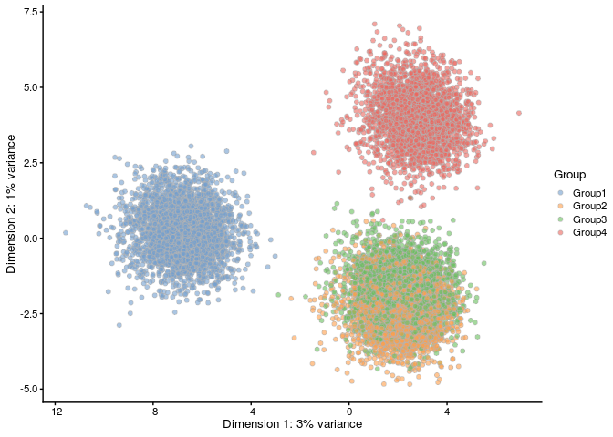
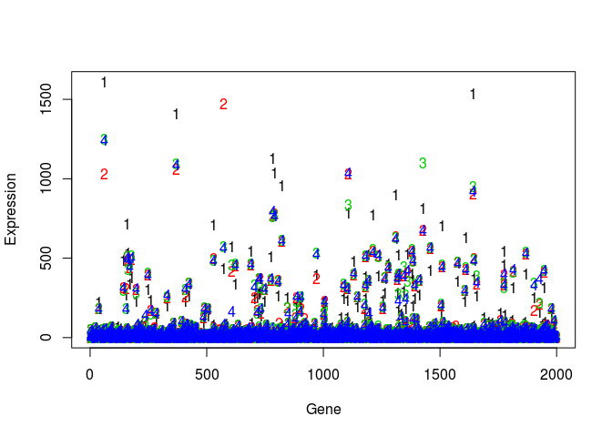

QC of splatter simulation data
================
asif zubair
9/4/2019

## QC of `Splatter` simulations

Let’s either build a new simulation or load an old one

``` r
newSim = TRUE
if (newSim){
    source("make_splatter_sim.R")
} else {
  library(deconR)  
}
```

    ## Getting parameters...

    ## Creating simulation object...

    ## Simulating library sizes...

    ## Simulating gene means...

    ## Simulating group DE...

    ## Simulating cell means...

    ## Simulating BCV...

    ## Simulating counts...

    ## Simulating dropout (if needed)...

    ## Done!

    ## Warning in .local(object, ...): using library sizes as size factors

    ## ✔ Setting active project to '/home/azubair/projects/deconR'
    ## ✔ Saving 'splat_props', 'splat_sigMat', 'splat_bulkExpression' to 'data/splat_props.rda', 'data/splat_sigMat.rda', 'data/splat_bulkExpression.rda'

Take a look at some data:

``` r
SingleCellExperiment::rowData(splat_sim)
```

    ## DataFrame with 2000 rows and 8 columns
    ##              Gene       BaseGeneMean OutlierFactor           GeneMean
    ##          <factor>          <numeric>     <numeric>          <numeric>
    ## Gene1       Gene1   6.45135872092825             1   6.45135872092825
    ## Gene2       Gene2 0.0725519730783946             1 0.0725519730783946
    ## Gene3       Gene3   1.23885592146663             1   1.23885592146663
    ## Gene4       Gene4   1.17640492247369             1   1.17640492247369
    ## Gene5       Gene5  0.197514300980963             1  0.197514300980963
    ## ...           ...                ...           ...                ...
    ## Gene1996 Gene1996 0.0104151107656626             1 0.0104151107656626
    ## Gene1997 Gene1997    1.3152411681482             1    1.3152411681482
    ## Gene1998 Gene1998 0.0812994812003122             1 0.0812994812003122
    ## Gene1999 Gene1999 0.0507980124101796             1 0.0507980124101796
    ## Gene2000 Gene2000   0.51040193291887             1   0.51040193291887
    ##                DEFacGroup1      DEFacGroup2       DEFacGroup3
    ##                  <numeric>        <numeric>         <numeric>
    ## Gene1                    1                1                 1
    ## Gene2                    1                1                 1
    ## Gene3     2.16401768228179                1  1.02493724898768
    ## Gene4                    1                1                 1
    ## Gene5                    1                1                 1
    ## ...                    ...              ...               ...
    ## Gene1996 0.551172654357728                1                 1
    ## Gene1997                 1                1                 1
    ## Gene1998                 1 1.37659198310672 0.744816484362254
    ## Gene1999  0.52496545066184                1 0.810659980561758
    ## Gene2000                 1                1                 1
    ##                DEFacGroup4
    ##                  <numeric>
    ## Gene1                    1
    ## Gene2                    1
    ## Gene3                    1
    ## Gene4                    1
    ## Gene5                    1
    ## ...                    ...
    ## Gene1996 0.483767860595075
    ## Gene1997                 1
    ## Gene1998                 1
    ## Gene1999                 1
    ## Gene2000                 1

``` r
head(splat_sigMat)
```

    ##           Group1     Group2     Group3     Group4
    ## Gene1 35.3917197 47.9444444 47.9943503 46.6212121
    ## Gene2  0.3726115  0.4055556  0.4293785  0.4878788
    ## Gene3 14.5732484  8.7944444  9.5875706  8.9606061
    ## Gene4  6.2579618  8.2833333  9.2768362  8.8333333
    ## Gene5  1.0509554  1.4666667  1.4350282  1.4757576
    ## Gene6  0.8662420  1.3111111  1.1016949  1.2909091

and some plots:

``` r
if (newSim)
  scater::plotPCA(splat_sim, colour_by = "Group")
```

<!-- -->

``` r
matplot(splat_sigMat, xlab = "Gene", ylab = "Expression")
```

<!-- -->
