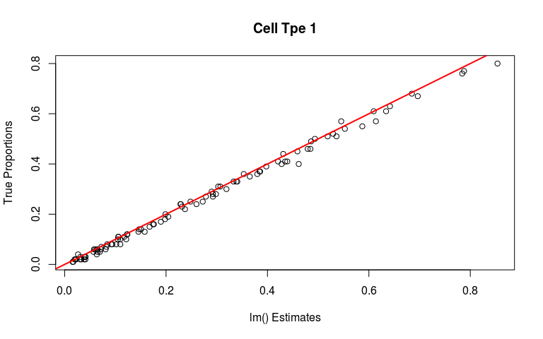
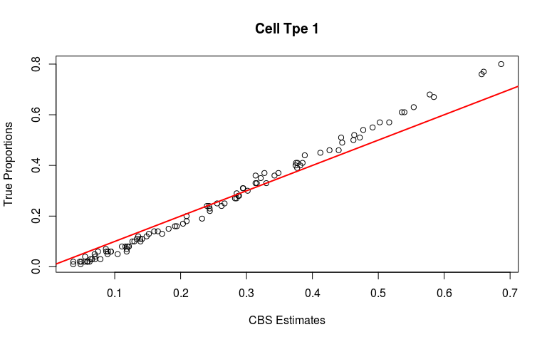
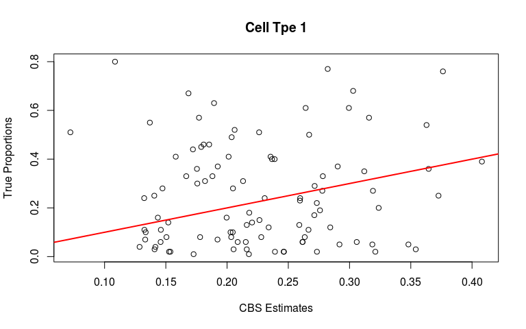

Comparing methods on Splatter simulations
================
asif zubair
8/29/2019

``` r
library(deconR)
source("~/projects/decon/CIBERSORT/CIBERSORT.R")
options(mc.cores = parallel::detectCores())
```

## Data

    ## Num. of Cell Types:  4 
    ## Num. of Genes:  2000 
    ## Num. of Bulk Samples:  100

## Fit

``` r
t(splat_props[,1:5])
```

    ##      [,1] [,2] [,3] [,4]
    ## [1,] 0.36 0.28 0.17 0.19
    ## [2,] 0.06 0.10 0.29 0.55
    ## [3,] 0.07 0.49 0.12 0.31
    ## [4,] 0.25 0.45 0.07 0.23
    ## [5,] 0.63 0.18 0.01 0.18

``` r
# let's also look at how linear regression does
pEstimate = list()
for (i in 1:ncol(splat_bulkExpression))
  pEstimate[[i]] <- coef(summary(lm(splat_bulkExpression[,i] ~ ., data = splat_sigMat)))[2:5,1]
lmEsts <- do.call(rbind, pEstimate)
lmEsts[1:5,]
```

    ##          Group1     Group2     Group3    Group4
    ## [1,] 0.35326706 0.30404190 0.14809515 0.2238420
    ## [2,] 0.06038641 0.09942836 0.27944465 0.5431694
    ## [3,] 0.07244853 0.47344360 0.13679012 0.3143336
    ## [4,] 0.24814864 0.47879232 0.08090611 0.2028482
    ## [5,] 0.64159197 0.19022179 0.02891447 0.1489125

``` r
# CIBERSORT
cbs <- CIBERSORT(sig_matrix = splat_sigMat, mixture_file = splat_bulkExpression, perm  = 20)
cbs[1:5, ]
```

    ##          Group1    Group2     Group3    Group4 P-value Correlation
    ## Bulk1 0.3137724 0.3133287 0.12084211 0.2520568       0   0.9996462
    ## Bulk2 0.1181207 0.1159039 0.27979028 0.4861851       0   0.9988022
    ## Bulk3 0.1182873 0.3970216 0.16308271 0.3216084       0   0.9989879
    ## Bulk4 0.2553931 0.4414648 0.06777842 0.2353637       0   0.9995412
    ## Bulk5 0.5537584 0.2048740 0.06467498 0.1766927       0   0.9979439
    ##             RMSE
    ## Bulk1 0.02899017
    ## Bulk2 0.05848488
    ## Bulk3 0.05408871
    ## Bulk4 0.03440828
    ## Bulk5 0.06717801

``` r
# BayCon
out <- baycon(bulkExpression = splat_bulkExpression, sigMat = splat_sigMat, 
              useHyperPrior = T, refresh = 0, iter = 3000)
out$stan$mean[1:5,]
```

    ##      estimatedProportionsVecSimp[1] estimatedProportionsVecSimp[2]
    ## [1,]                     0.34911409                     0.27708972
    ## [2,]                     0.07349589                     0.09489192
    ## [3,]                     0.07499817                     0.46496810
    ## [4,]                     0.24881895                     0.41005814
    ## [5,]                     0.63539514                     0.15630482
    ##      estimatedProportionsVecSimp[3] estimatedProportionsVecSimp[4]
    ## [1,]                     0.18134991                      0.1924463
    ## [2,]                     0.28243082                      0.5491814
    ## [3,]                     0.14231409                      0.3177196
    ## [4,]                     0.09730187                      0.2438210
    ## [5,]                     0.03225428                      0.1760458

<!-- -->

    ## Correlation: 0.998164

<!-- -->

    ## Correlation: 0.9975055

<!-- -->

    ## Correlation: 0.9896048
